# Execution Plan - Coder Go Happy

**Generated**: February 23, 2026  
**Project**: Coder Go Happy - Point-and-Click Puzzle Game  
**Timeline**: 9 days (Feb 23 → Mar 4) + 16 days polish (Mar 5 → Mar 20)  
**Approach**: All Levels Baseline (R2)

---

## Detailed Analysis Summary

### Project Type
**Greenfield Unity 2D Game** - Building from scratch with basic URP setup and DOTween plugin

### Change Impact Assessment
- **User-facing changes**: Complete new game creation
- **Structural changes**: Full architecture from ground up
- **Data model changes**: Game state, inventory, puzzle systems, save data
- **API changes**: N/A (not applicable for single-player game)
- **NFR impact**: Performance (60 FPS), reusability/extensibility (critical), art quality progressive

### Risk Assessment
- **Risk Level**: HIGH
- **Rationale**: Aggressive 9-day timeline for 3 complete levels, new genre for team, significant art production
- **Rollback Complexity**: N/A (greenfield)
- **Testing Complexity**: Moderate - gameplay mechanics verification, puzzle logic validation

---

## Workflow Visualization

### Phase Flow Diagram

```mermaid
flowchart TD
    Start([User Request: Coder Go Happy Game])
    
    subgraph INCEPTION[🔵 INCEPTION PHASE]
        WD[Workspace Detection<br/>COMPLETED]
        RA[Requirements Analysis<br/>COMPLETED]
        US[User Stories<br/>SKIPPED]
        WP[Workflow Planning<br/>IN PROGRESS]
        AD[Application Design<br/>EXECUTE]
        UG[Units Generation<br/>EXECUTE]
    end
    
    subgraph CONSTRUCTION[🟢 CONSTRUCTION PHASE]
        PerUnit[Per-Unit Loop for each Unit]
        FD[Functional Design<br/>EXECUTE per unit]
        NFRA[NFR Requirements<br/>EXECUTE per unit]
        NFRD[NFR Design<br/>EXECUTE per unit]
        ID[Infrastructure Design<br/>SKIP]
        CP[Code Planning<br/>EXECUTE per unit]
        CG[Code Generation<br/>EXECUTE per unit]
        BT[Build and Test<br/>EXECUTE]
    end
    
    subgraph OPERATIONS[🟡 OPERATIONS PHASE]
        OPS[Operations<br/>PLACEHOLDER]
    end
    
    Start --> WD
    WD --> RA
    RA --> US
    US -.skipped.-> WP
    WP --> AD
    AD --> UG
    UG --> PerUnit
    PerUnit --> FD
    FD --> NFRA
    NFRA --> NFRD
    NFRD --> ID
    ID -.skipped.-> CP
    CP --> CG
    CG -.next unit.-> FD
    CG --> BT
    BT --> OPS
    OPS -.future.-> Complete([Complete])
    
    style WD fill:#4CAF50,stroke:#1B5E20,stroke-width:3px,color:#fff
    style RA fill:#4CAF50,stroke:#1B5E20,stroke-width:3px,color:#fff
    style US fill:#BDBDBD,stroke:#424242,stroke-width:2px,stroke-dasharray:5 5,color:#000
    style WP fill:#FFA726,stroke:#E65100,stroke-width:3px,color:#000
    style AD fill:#FFA726,stroke:#E65100,stroke-width:3px,stroke-dasharray:5 5,color:#000
    style UG fill:#FFA726,stroke:#E65100,stroke-width:3px,stroke-dasharray:5 5,color:#000
    style FD fill:#FFA726,stroke:#E65100,stroke-width:3px,stroke-dasharray:5 5,color:#000
    style NFRA fill:#FFA726,stroke:#E65100,stroke-width:3px,stroke-dasharray:5 5,color:#000
    style NFRD fill:#FFA726,stroke:#E65100,stroke-width:3px,stroke-dasharray:5 5,color:#000
    style ID fill:#BDBDBD,stroke:#424242,stroke-width:2px,stroke-dasharray:5 5,color:#000
    style CP fill:#4CAF50,stroke:#1B5E20,stroke-width:3px,color:#fff
    style CG fill:#4CAF50,stroke:#1B5E20,stroke-width:3px,color:#fff
    style BT fill:#4CAF50,stroke:#1B5E20,stroke-width:3px,color:#fff
    style OPS fill:#BDBDBD,stroke:#424242,stroke-width:2px,stroke-dasharray:5 5,color:#000
    style Start fill:#CE93D8,stroke:#6A1B9A,stroke-width:3px,color:#000
    style Complete fill:#CE93D8,stroke:#6A1B9A,stroke-width:3px,color:#000
```



### Text-Based Workflow Representation

```
WORKFLOW EXECUTION PLAN
=======================

Phase 1: INCEPTION
├─ Workspace Detection ..................... [COMPLETED]
├─ Requirements Analysis ................... [COMPLETED]
├─ User Stories ............................ [SKIPPED - tight timeline]
├─ Workflow Planning ....................... [IN PROGRESS]
├─ Application Design ...................... [EXECUTE - core architecture needed]
└─ Units Generation ........................ [EXECUTE - parallel work distribution]

Phase 2: CONSTRUCTION (Per-Unit Loop)
├─ Functional Design ....................... [EXECUTE per unit - complex systems]
├─ NFR Requirements Assessment ............. [EXECUTE per unit - performance/reusability]
├─ NFR Design .............................. [EXECUTE per unit - design patterns]
├─ Infrastructure Design ................... [SKIP - no complex infrastructure]
├─ Code Planning ........................... [EXECUTE per unit - ALWAYS]
├─ Code Generation ......................... [EXECUTE per unit - ALWAYS]
└─ Build and Test .......................... [EXECUTE - ALWAYS]

Phase 3: OPERATIONS
└─ Operations .............................. [PLACEHOLDER - future deployment]
```

---

## Phases to Execute

### 🔵 INCEPTION PHASE

#### ✅ Workspace Detection - COMPLETED
- **Status**: Done
- **Findings**: Greenfield Unity project, URP setup, DOTween available

#### ✅ Requirements Analysis - COMPLETED
- **Status**: Done
- **Deliverables**: 
  - requirements.md (19 functional requirements, 10 NFRs)
  - requirement-verification-questions.md (answered)
  - follow-up-questions.md (answered)

#### ⏭️ User Stories - SKIPPED
- **Rationale**: Tight 9-day timeline, game design already well-documented in docs/overview.md
- **Trade-off**: Saves 1-2 days, acceptable for small team with clear design

#### 🔄 Workflow Planning - IN PROGRESS
- **Status**: Currently executing
- **Deliverables**: This execution plan

#### ⬜ Application Design - EXECUTE
- **Rationale**: MUST design core game architecture before coding
- **Scope**: 
  - Core systems architecture (scene management, inventory, hotspot detection, puzzle framework)
  - Data models (Item, Hotspot, PuzzleConfig, GameState, etc.)
  - Component relationships and dependencies
  - Unity-specific patterns (ScriptableObjects, prefabs, managers)
- **Estimated Duration**: 0.5-1 day
- **Priority**: CRITICAL - foundation for all development

#### ⬜ Units Generation - EXECUTE
- **Rationale**: Large project needs decomposition for parallel work
- **Scope**: Break down into work units for 2 devs + 3 artists
- **Proposed Units**:
  1. **Core Systems Development** (Dev Unit 1)
  2. **Level 1 Implementation** (Dev Unit 2)
  3. **Level 2-3 Implementation** (Dev Unit 3)
  4. **Art Assets - Characters & Animations** (Art Unit 1)
  5. **Art Assets - Backgrounds & Scenes** (Art Unit 2)
  6. **Art Assets - UI & Items** (Art Unit 3)
- **Estimated Duration**: 0.5 day
- **Priority**: HIGH - enables parallel development

---

### 🟢 CONSTRUCTION PHASE

**Per-Unit Loop**: Each unit goes through design stages before code generation

#### ⬜ Functional Design - EXECUTE (per unit)
- **Rationale**: Complex game mechanics need detailed design
- **Scope per unit**:
  - Business logic flow (puzzle solving, state transitions)
  - Data structures and algorithms
  - Scene interaction logic
  - Unity component design
- **Estimated Duration**: 0.5 day per unit (parallel for multiple units)
- **Priority**: HIGH

#### ⬜ NFR Requirements Assessment - EXECUTE (per unit)
- **Rationale**: Performance and reusability are critical NFRs
- **Scope per unit**:
  - Performance targets (60 FPS, fast scene loading)
  - Reusability requirements (data-driven systems)
  - Memory optimization for mobile potential
  - Asset optimization strategies
- **Estimated Duration**: 0.25 day per unit
- **Priority**: MEDIUM-HIGH

#### ⬜ NFR Design - EXECUTE (per unit)
- **Rationale**: Need design patterns for extensible architecture
- **Scope per unit**:
  - Design patterns (Factory, Observer, Command for game systems)
  - ScriptableObject architecture for data-driven design
  - Object pooling for performance
  - Event system for decoupling
- **Estimated Duration**: 0.25 day per unit
- **Priority**: HIGH (team specified reusable systems)

#### ⏭️ Infrastructure Design - SKIP
- **Rationale**: Single-player Unity game, no complex infrastructure layer
- **Trade-off**: No deployment architecture, networking, or cloud services needed
- **Note**: Build settings and export will be handled in Build and Test phase

#### ⬜ Code Planning - EXECUTE (per unit, ALWAYS)
- **Rationale**: Required phase for implementation approach
- **Scope**: Detailed implementation plan with checkboxes and file structure
- **Estimated Duration**: 0.5 day per unit (parallel)
- **Priority**: CRITICAL

#### ⬜ Code Generation - EXECUTE (per unit, ALWAYS)
- **Rationale**: Actual implementation of game
- **Scope**: C# scripts, Unity scenes, prefabs, ScriptableObjects
- **Estimated Duration**: 5-7 days (majority of timeline, parallel across units)
- **Priority**: CRITICAL

#### ⬜ Build and Test - EXECUTE (ALWAYS)
- **Rationale**: Verify all systems work together
- **Scope**: 
  - Build instructions for Unity
  - Unit test instructions
  - Integration test instructions (level flow, puzzle solving)
  - Playtesting guide
- **Estimated Duration**: 1 day
- **Priority**: CRITICAL

---

### 🟡 OPERATIONS PHASE

#### ⏭️ Operations - PLACEHOLDER
- **Status**: Future expansion
- **Note**: Competition submission handled manually

---

## Estimated Timeline

### INCEPTION Phase (2 days)
- ✅ Workspace Detection: 0.25 day (DONE)
- ✅ Requirements Analysis: 1 day (DONE)
- 🔄 Workflow Planning: 0.25 day (IN PROGRESS)
- ⬜ Application Design: 0.5-1 day
- ⬜ Units Generation: 0.5 day

**INCEPTION Total**: ~2-2.5 days

### CONSTRUCTION Phase (6-7 days)
- ⬜ Per-Unit Design Stages: 1-1.5 days (parallel across units)
- ⬜ Code Generation: 5-6 days (majority, parallel development)
- ⬜ Build and Test: 0.5-1 day

**CONSTRUCTION Total**: ~6.5-7.5 days

### TOTAL CORE TIMELINE: ~9 days (Feb 23 → Mar 4) ✅

### POST-CORE POLISH (16 days: Mar 5 → Mar 20)
- Art polish Level 2-3 to 100%
- Bug fixes and optimization
- Playtesting and balancing
- Final competition build

---

## Work Distribution Strategy

### Developer Track (2 Developers)

**Dev 1: Core Systems Architect**
- Days 1-2: Design and implement core framework
  - Scene management system
  - Inventory system
  - Hotspot detection framework
  - Puzzle input system
  - Item interaction system
- Days 3-4: Level 1 implementation (using core systems)
- Days 5-7: Level 2 implementation
- Days 8-9: Integration, bug fixes, testing support

**Dev 2: Content Implementation**
- Days 1-2: Learn core systems while Dev 1 builds (pair programming)
- Days 3-4: Level 1 puzzles and interactions (parallel with Dev 1)
- Days 5-7: Level 3 implementation
- Days 8-9: Bug collection system, UI polish, testing

### Art Track (3 Artists)

**Artist 1: Character Artist**
- Days 1-2: Character design (Coder sad/happy states)
- Days 3-4: Character sprite creation (Level 1 quality)
- Days 5-9: Mini-Bugs design and creation (30+ unique bugs), character animations

**Artist 2: Background Artist**
- Days 1: Style guide and Level 1 scene concepts
- Days 2-4: Level 1 backgrounds (3 scenes, 100% quality)
- Days 5-7: Level 2 backgrounds (4 scenes, 70-80%)
- Days 8-9: Level 3 backgrounds (3 scenes, 70-80%)

**Artist 3: UI & Items Artist (Designer)**
- Days 1-2: UI design (inventory, menus, HUD, puzzle interfaces)
- Days 3-4: Level 1 item sprites and tool designs (100% quality)
- Days 5-7: Level 2-3 items (70-80%)
- Days 8-9: UI implementation support, icon polish

**Gemini Banana Pro Support**: All artists can use for generation assistance and iteration

---

## Success Criteria

### Core Milestone (March 4) - PRIMARY GOAL
- [ ] All 3 levels playable end-to-end
- [ ] All core systems functional
- [ ] Level 1 at 100% art quality
- [ ] Level 2-3 at 70-80% art quality
- [ ] All puzzles implemented (bugs acceptable)
- [ ] All 30+ Mini-Bugs placed
- [ ] UI complete and functional

### Final Milestone (March 20) - COMPETITION READY
- [ ] All levels at 100% art quality
- [ ] All bugs fixed
- [ ] Performance optimized (60 FPS)
- [ ] Playtested and balanced
- [ ] Competition build ready

---

## Risk Mitigation Strategies

### Risk 1: Timeline Pressure (HIGH probability, HIGH impact)
**Mitigation**:
- Clear work distribution from Day 1
- Daily standups (5-10 min sync)
- Focus on core systems reusability first
- Accept 70-80% art quality for L2-3
- Backup plan ready (cut Level 3 if needed)

### Risk 2: Point-and-Click Learning Curve (MEDIUM)
**Mitigation**:
- Dev 1 builds core framework while Dev 2 learns
- Pair programming Days 1-2
- Reusable systems mean learning once, apply many times

### Risk 3: Art Production Bottleneck (MEDIUM)
**Mitigation**:
- Gemini Banana Pro for generation support
- Accept 70-80% quality for L2-3 by core deadline
- Clear art priorities (Level 1 first, highest quality)

### Risk 4: Integration Issues (MEDIUM)
**Mitigation**:
- Daily builds to catch issues early
- Unit structure allows independent testing
- Final 1-2 days reserved for integration testing

### Risk 5: Scope Creep (LOW but possible)
**Mitigation**:
- Clear requirements document locked in
- Out-of-scope list explicit
- Team agreement on backup plan (cut features if needed)

---

## Next Steps After Approval

1. ✅ **Application Design** (0.5-1 day)
   - Design core game architecture
   - Define data models and Unity patterns
   
2. ✅ **Units Generation** (0.5 day)
   - Formalize work units
   - Create detailed unit descriptions
   
3. ✅ **Construction Phase** (6-7 days)
   - Execute per-unit loop for each unit
   - Parallel development (2 devs + 3 artists)
   
4. ✅ **Build and Test** (0.5-1 day)
   - Integration testing
   - Build competition-ready executable

---

**Document Status**: FINAL  
**Ready for**: User approval to proceed to Application Design phase
